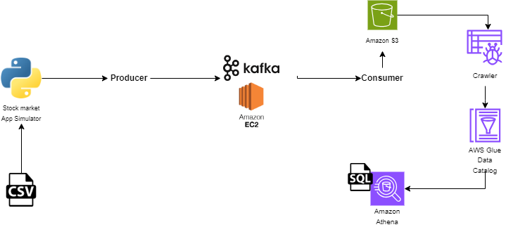

## Real-time Data Analysis on Stock Market using Kafka
End-To-End Data Engineering Project on Real-Time Stock Market data using Kafka

# Technologies 
- Python
- Kafka
- EC2
- S3 Bucket
- Crawler
- AWS Glue Data Catalog
- Amazon Athena

# Architecture

